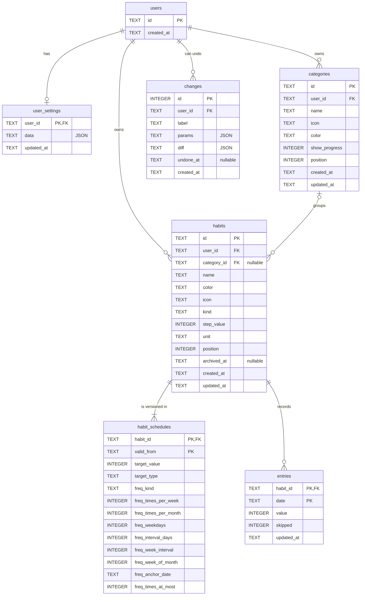

# Data model

The data lives in SQLite. Each table has a section below; the rules that hang
off a table (kinds, frequencies, streaks) follow it.

## Users

`users` holds one row per user ID: `local` (`HABITS_DEFAULT_USER`) in
single-user mode, or the ID the reverse proxy sends (see
[DEPLOYMENT.md](DEPLOYMENT.md#configuration)). A user is recorded on their
first write; reading needs no row. Every other table hangs off it, so deleting
a user removes all their data.

## Settings

`user_settings` stores a user's settings as one JSON document in `data`. A
user without a row gets the defaults. The settings are listed in
[USAGE.md](USAGE.md#settings).

## Categories

`categories` groups habits into blocks on the overview, ordered by
`position`. A category has a `name`, an optional `icon` and an optional icon
`color` (empty for the default colour); `show_progress` shows today's progress
in its heading.

Habits without a category are shown in a "No category" block; without any
categories, the board is a single block without headings. When a category is
deleted, its habits stay without one (`ON DELETE SET NULL`); undoing the
deletion puts them back.

## Habits

`habits` holds what a habit is, apart from its target and frequency, which
are versioned in [`habit_schedules`](#schedules).

- `id`: a random 128-bit ID in hex
- `name`: up to 80 characters, not empty
- `color`: a palette name (see [Colours](#colours)); `icon`: one of the habit
  icons, or empty
- `category_id`: the category, or `NULL` for none
- `kind`: what a day records (see [Kinds](#kinds))
- `step_value`: how much one tap adds, in stored units; defaults to the
  kind's step (one, five minutes, half a kilometre) and is always 1 for
  check habits
- `unit`: chosen by the user for count habits (up to 16 characters), fixed to
  `min` for time and `m` for distance, empty for check
- `position`: the order on the overview; a new habit goes to the end
- `archived_at`: when the habit was archived, or `NULL`. Archived habits keep
  their history; the overview hides them unless `showArchived` is on, and
  the day statistics and skipping all habits leave them out.
- `created_at`, `updated_at`

A habit's history starts with its first schedule, or on its earliest entry
if that is earlier (`domain.HistoryStart`). The first schedule starts on the
day the habit was created in the user's time zone; `created_at` is a time in
UTC, whose date can be a day off. Imported habits keep their first schedule.

### Kinds

- `check`: done or not
- `count`: a number, e.g. 8 glasses
- `time`: minutes
- `distance`: stored in metres, shown in kilometres

A day's value is one integer; counts and minutes are stored in tenths.

The kind is chosen when a habit is created and cannot be changed afterwards
(`kind_unchangeable`), as the recorded values and the targets only have a
meaning in its unit. For another kind, create a new habit.

## Schedules

`habit_schedules` versions a habit's target, target type (target or limit)
and frequency; its key is the habit and `valid_from`, the first day a version
applies to. A valid habit has at least one version. Each applies until the
next one starts; the first one also covers days before it (entries recorded
before the habit was created).

A change in the editor starts a new version from today on; past days keep the
target and frequency they had, so their completion and streaks do not change.
Several changes on one day replace that day's version, and changing back
merges it with the previous one. "Apply to past days as well" replaces the
whole history with the new schedule; the editor offers it whenever the
schedule changes or the habit has more than one version, so an earlier change
can still be applied to the past later.

For a times-per-week or times-per-month habit, periods from before a switch to
that frequency are met when every day due in them was completed; periods
without a due day neither extend nor break the streak. After a switch from
such a frequency to fixed days, the days before it count as their status
shows: the days a met period no longer needed are not due, so they neither
lower the completion rate nor break the streak.

### Targets and limits

`target_value` and `target_type` hold the day's goal. A measured habit (count,
time, distance) has a target to reach (`at_least`, done when
`value >= target`) or a limit to stay within (`at_most`, done when
`value <= target`). A limit may be 0, "none at all". A limit is also kept by a
day without a value, from the habit's first day on: nothing recorded means
nothing consumed. As empty days keep it, a limit needs fixed due days: it
cannot be combined with `times_per_week` or `times_per_month`, whose count of
completed days would always be met. Check habits always have the target 1.

### Frequencies

`freq_kind` is one of these; the other `freq_` columns hold its parameters
and are 0 or empty when unused:

- `daily`
- `times_per_week`: x times per week (weeks start on Monday)
- `times_per_month`: x times per calendar month (1 to 28, so the target fits
  every month)
- `weekdays`: selected weekdays (bitmask, bit 0 = Monday), optionally only every
  n-th week from an anchor date, or only the n-th or last occurrence in the
  month
- `custom_interval`: every n days from an anchor date

The times per week or month are a minimum (`timesAtMost` false) or a maximum
(`timesAtMost` true). Every day of such a period is due until it has as many
completed days as it needs, skipped days lowering that number (see
[Entries](#entries)); then its other days are no longer due
(`domain.Habit.Status`). With a minimum they stay open for a bonus: further
completed days are done on top, not due, and take the day's progress beyond
100%. With a maximum they are closed, and the server refuses to complete
another day of the period (`times_maximum_reached`). The days count in the
order of the calendar: the earliest completed days are the ones the period
needs.

The frequency rules exist only on the server (`domain.Schedule.IsScheduled`);
see [DATAFLOW.md](DATAFLOW.md#day-statuses) for how the client learns the
status of each day.

## Entries

`entries` holds a day's entry (`domain.Entry`): its value and whether the day
is skipped, keyed by habit and `date`. Days with nothing recorded have no row.
A value or a skip can only be recorded on a due day; removing is possible on
any day.

**Skipped days** (sick, on holiday) count as not due: they neither extend nor
break a streak and are left out of the completion rate. A skipped day has no
value; recording a value ends the skip. For times-per-week and
times-per-month habits, each skipped day lowers the period's target in
proportion, rounded up (three times a week with four days skipped needs two),
future skipped days included, so a planned holiday counts for the current week.
A period skipped entirely neither extends nor breaks the streak. A range of
days skipped at once (`domain.DaysToSkip`) only changes due days without a
value, so what was done on a day is never erased by a holiday.

## Streaks

Streaks and statistics are not stored; the server computes them from the
schedules and entries on every request.

An open today does not break a streak, and skipped days neither extend nor
break it. For `times_per_week`, the streak counts weeks; for
`times_per_month`, months. Both are counted by `domain.period`.

**Completion rate**: the share of the due days completed in the days of the
`rateWindow` setting (30 by default, or the whole history), from the habit's
first day on; skipped days are left out. For times-per-week and
times-per-month habits, the window is extended to whole periods and counts
completions (`domain.ComputeStats`).

**Streak colours**: A completed day is coloured by how long its run had lasted
on that day: one week, two weeks, a month, three months, six months, a year.
The longer the run, the more of a gradient around the habit colour shows. Run
lengths are in calendar days. The server sends the runs as `streakRuns`
(`domain.StreakRuns`); the colouring is in `habit-helpers.js`.

## Changes

`changes` keeps the undo steps: per change a `label` (a text template) and
its `params`, which make up the undo message, and as `diff` the rows the change replaced and wrote, as JSON
(see [DATAFLOW.md](DATAFLOW.md#undo)). `undone_at` is set while a step is
undone. IDs are never reused, as a client may still offer to undo a step that
has been dropped since. The latest 100 steps per user are kept; steps older
than 30 days are removed on start and once a day.

## Colours

Habits, categories and the accent colour store palette names (`red`, `teal`,
…). `base.css` defines their shades as `--c-red` and so on, and `colorValue()`
in `icons.js` maps a name to its custom property. Changing a shade needs no
migration.

## Database schema

The tables are `STRICT`, with `CHECK` constraints for kinds, frequencies,
dates and values. Dates are `YYYY-MM-DD`, times RFC 3339. Every user-owned
row refers to `users` with `ON DELETE CASCADE`, and schedules and entries
refer to their habit the same way, so deleting a habit removes its rows.

`PRAGMA user_version` stores the schema version. See
[EXTENDING.md](EXTENDING.md#new-migration) for adding a migration.
